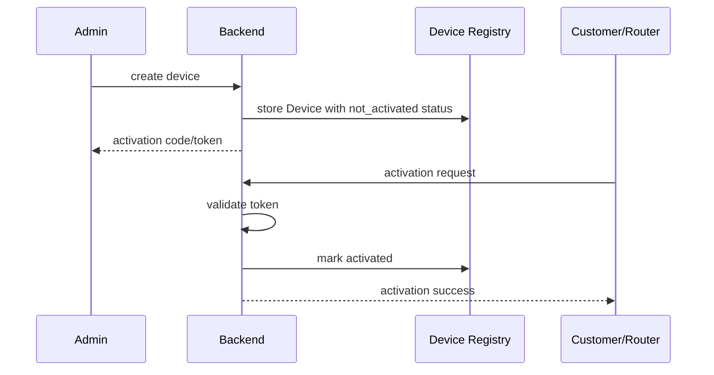

# Device Activation

Device Activation — это процесс, который подтверждает, что физический роутер имеет право присоединиться к платформе и управляться backend.

Активация связывает заранее известное или зарегистрированное физическое устройство с управляемым состоянием платформы. Она не должна быть привязана к WG-Easy, WireGuard, конкретному VPN-профилю или биллингу. Цель активации — безопасно перевести устройство из состояния `not_activated` или `activation_pending` в состояние `activated`.

OpenWrt и будущий router agent являются целевым направлением развития, но в текущей архитектуре они не считаются уже реализованными.

## Что такое Device Activation

Device Activation — это контролируемый процесс первичного допуска физического роутера в платформу.

Активация отвечает на вопрос:

```text
Разрешено ли этому физическому устройству стать управляемым устройством платформы?
```

Активация не является тем же самым, что:

- VPN-подключение;
- назначение VPN-профиля;
- subscription billing;
- router telemetry;
- remote management.

Устройство может быть активировано, но еще не иметь VPN-конфигурации. Также устройство может иметь действующую запись в Device Registry, но еще не быть активированным.

## Зачем нужна Device Activation

Device Activation нужна для того, чтобы пользовательский onboarding оставался простым, а платформа сохраняла контроль над тем, какие устройства становятся управляемыми.

Основные причины:

- простой клиентский onboarding: пользователь должен получить понятный процесс первого запуска;
- контролируемая первичная настройка: первичная настройка должна проходить через backend;
- защита от подключения неизвестных устройств: неизвестные устройства не должны самовольно присоединяться к платформе;
- подготовка к будущему router agent: будущему агенту нужна безопасная первичная идентификация;
- подготовка к будущему heartbeat/status: heartbeat должен исходить от активированного устройства;
- подготовка к будущей выдаче VPN config: выдача VPN-конфигурации должна быть возможна только после контролируемого допуска;
- диагностика для поддержки: поддержка должна видеть, на каком этапе застряло устройство.

Активация особенно важна для managed VPN routers, потому что пользователь ожидает поведение "включил и работает", а команда поддержки должна понимать, что произошло на каждом этапе.

## Простой MVP-поток активации

Планируемый flow:

1. Admin создает `Device` в backend.
2. Backend генерирует activation code или activation token.
3. Code/token передается клиенту или заранее загружается в роутер.
4. Router или operator отправляет activation request.
5. Backend валидирует activation data.
6. Backend помечает устройство как `activation_status = activated`.
7. Backend может позже вернуть VPN configuration или provisioning instructions.
8. Device может позже использовать device credentials для heartbeat/status.

На текущем этапе это только дизайн. Реализация activation token, router-agent endpoint, heartbeat и выдача VPN-конфигурации не входят в текущий CRUD v1.

## Будущие доменные концепции

### DeviceActivationToken

`DeviceActivationToken` представляет одноразовый или ограниченный по времени токен активации.

Возможные поля:

- `id`;
- `device_id`;
- `token_hash`;
- `status`;
- `expires_at`;
- `used_at`;
- `created_at`;
- `updated_at`.

Токен нужен для того, чтобы backend мог проверить право активации без хранения исходного кода или токена в открытом виде.

### DeviceActivationTokenStatus

`DeviceActivationTokenStatus` описывает состояние токена активации.

Возможные значения:

- `active`;
- `used`;
- `expired`;
- `revoked`.

Статус позволяет безопасно обрабатывать повторные попытки, истекшие токены и ручной отзыв токена оператором.

### DeviceSecret

`DeviceSecret` представляет будущий секрет устройства после успешной активации.

Возможные поля:

- `device_id`;
- `secret_hash`;
- `created_at`;
- `rotated_at`;
- `revoked_at`.

Device secret может использоваться будущим router agent для authenticated heartbeat или других device-agent запросов. Секрет не должен храниться в открытом виде.

### ActivationAttempt

`ActivationAttempt` фиксирует попытку активации.

Возможные поля:

- `id`;
- `device_id`;
- `result`;
- `failure_reason`;
- `source_ip_optional`;
- `created_at`.

Activation attempts нужны для аудита, диагностики и будущего rate limiting.

Эти концепции могут быть реализованы позже и не являются частью текущего Device Registry CRUD v1.

## Модель токена и безопасности

Activation token или activation code должен проектироваться как чувствительный секрет.

Принципы:

- не хранить activation token/code в plain text;
- хранить только hash;
- token должен быть one-time;
- token должен быть time-limited;
- token можно отозвать;
- успешная активация должна помечать token как `used`;
- failed attempts должны быть auditable;
- в будущем неуспешные попытки должны ограничиваться rate limiting;
- MAC address не является trusted secret;
- serial number полезен для diagnostics, но не должен быть единственным secret;
- VPN config нельзя выдавать только потому, что кто-то знает `device_id`.

MAC address и serial number удобны для диагностики и support flow, но они не являются достаточным доказательством владения устройством.

## Связь с Device Registry

Device Registry хранит физическое устройство и его основные поля.

Device Activation работает поверх Device Registry:

- меняет `activation_status`;
- может переводить устройство из `not_activated` или `activation_pending` в `activated`;
- может обновлять `last_seen_at`;
- может позже создавать событие активации;
- не заменяет Device Registry;
- не должна знать деталей WG-Easy.

Device Registry отвечает за существование и состояние физического устройства. Device Activation отвечает за безопасный допуск этого устройства в управляемую платформу.

## Связь с VPN-доменом

Активация дает устройству разрешение присоединиться к платформе. Она не создает WireGuard peer и не назначает VPN profile напрямую.

Правильное разделение:

- activation проверяет и активирует физическое устройство;
- VPN profile assignment является отдельным последующим шагом;
- activated device может позже запросить или получить VPN config;
- `ProtocolProfile` и `VPNProvider` abstraction должны оставаться отдельными;
- activation нельзя моделировать как WireGuard peer creation.

Такой подход сохраняет protocol-agnostic архитектуру. В будущем устройство может получить WireGuard, AmneziaWG, OpenVPN или другой профиль без изменения смысла активации.

## Связь с подписками

Subscription может позже определять, имеет ли активированное устройство право получать VPN service.

Важно разделять:

- activation не означает, что subscription оплачена;
- subscription не заменяет activation;
- billing enforcement не входит в scope этого документа;
- активированное устройство может быть технически допущено к платформе, но коммерческий доступ может зависеть от подписки.

Это разделение важно для поддержки сценариев продаж, возвратов, grace period, trial и корпоративных аккаунтов.

## Направление API

### Admin API

Будущие admin endpoints:

- `POST /devices/:id/activation-token`;
- `POST /devices/:id/revoke-activation`;
- `POST /devices/:id/activate-manually`.

Admin API нужен для операторов, поддержки и внутренних процессов подготовки устройств.

### API router agent

Будущие router-agent endpoints:

- `POST /device-agent/activate`;
- `POST /device-agent/heartbeat`.

Router-agent API должен быть отделен от Admin API. У них разные trust boundaries, authentication model, rate limiting и error handling.

В текущем этапе эти endpoints не реализуются. Документ фиксирует только направление архитектуры.

## Границы MVP

Для текущего архитектурного этапа входит:

- только документация;
- без backend implementation;
- без DB changes;
- без token generation;
- без router agent endpoint;
- без heartbeat;
- без VPN config delivery;
- без subscription enforcement.

Будущая реализация может включать:

- activation token generation;
- token hashing;
- manual activation endpoint;
- activation attempt logging;
- router-agent activation endpoint;
- device secret generation;
- authenticated heartbeat.

## Mermaid sequence-диаграмма



## Заключение

Device Activation — это мост между зарегистрированным физическим роутером и управляемым устройством платформы. Она должна оставаться независимой от WG-Easy, WireGuard, назначения VPN-профиля и billing, чтобы платформа могла развиваться в сторону automatic activation, subscriptions и remote management без смешивания доменных границ.
