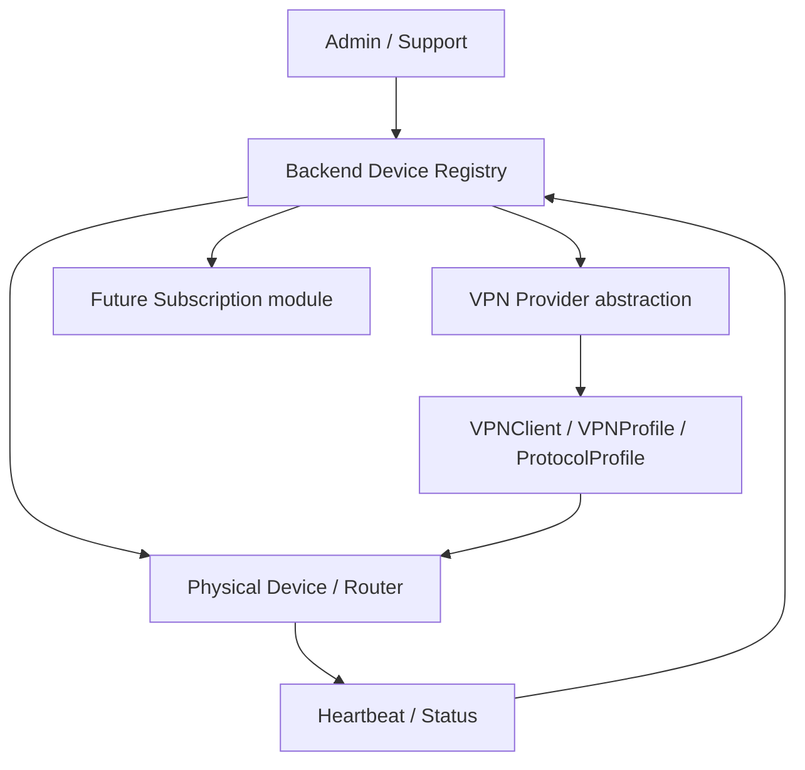

# Device Registry

Device Registry — это центральный реестр физических VPN-роутеров, которыми управляет платформа.

Цель модуля — описывать и отслеживать именно физические устройства: проданные, подготовленные, активированные, назначенные пользователям и подключенные к сервису. Device Registry не должен быть привязан к WG-Easy, WireGuard или любому другому конкретному VPN-провайдеру.

Платформа строится вокруг managed VPN routers: пользователь получает простой роутер, который можно активировать, подключить к подписке и обслуживать удаленно. Внутренняя архитектура при этом должна оставаться расширяемой: OpenWrt является основной целевой платформой для MVP, но домен не должен быть жестко ограничен только OpenWrt.

## Что такое Device Registry

`Device` — это физический роутер.

`Device` не является WireGuard peer. WireGuard peer, VPN peer или VPN client — это технический VPN-доступ, который может быть назначен устройству. Устройство существует независимо от конкретного VPN-протокола и конкретной реализации VPN-провайдера.

Связанные понятия:

- `Device` — физический роутер, которым управляет платформа.
- `VPNClient` или `VPNPeer` — VPN-доступ, выданный устройству или пользователю.
- `ProtocolProfile` — будущий профиль подключения: протокол, transport, порт, сервер, fallback-параметры и ограничения совместимости.
- `Device Registry` — реестр физических устройств, их статусов, владельцев, моделей, прошивок и событий жизненного цикла.

Device Registry должен оставаться независимым от WG-Easy. WG-Easy может быть текущей инфраструктурной реализацией выдачи VPN-доступа, но он не должен определять модель физического устройства.

## Почему Device Registry нужен сейчас

Device Registry нужен уже на ранней стадии, потому что платформа продает не абстрактный VPN-аккаунт, а физический управляемый роутер.

Основные причины:

- physical router tracking: нужно понимать, какие устройства существуют, проданы, активированы, отключены или выведены из эксплуатации;
- activation flow: устройство должно проходить контролируемую активацию;
- user assignment: роутер должен быть привязан к пользователю или аккаунту;
- support diagnostics: поддержке нужно видеть модель, ревизию, прошивку, статус и последние события;
- firmware and model tracking: разные модели и ревизии могут вести себя по-разному;
- future router agent: будущий агент на роутере должен иметь устойчивую идентичность устройства;
- future subscription integration: подписка должна управлять правом устройства на VPN-доступ;
- future remote management: удаленное управление невозможно без надежного реестра устройств.

Даже если первая backend-версия начнется с ручного CRUD, правильная доменная граница нужна заранее.

## Основные доменные концепции

### Device

`Device` описывает физический роутер.

Предлагаемые поля:

- `id` — внутренний идентификатор устройства;
- `name` — человекочитаемое имя устройства;
- `status` — технический статус устройства;
- `activation_status` — статус активации;
- `owner_user_id` — пользователь или аккаунт, которому назначено устройство;
- `router_model` — модель роутера;
- `router_revision` — аппаратная ревизия;
- `serial_number` — серийный номер;
- `hardware_id` — аппаратный идентификатор, если доступен;
- `mac_address` — MAC-адрес, если нужен для диагностики;
- `firmware_version` — версия нашей или поставляемой прошивки;
- `openwrt_version` — версия OpenWrt, если устройство работает на OpenWrt;
- `architecture` — архитектура устройства, например `aarch64`, `mips`, `x86_64`;
- `platform` — платформа прошивки или runtime;
- `last_seen_at` — время последнего heartbeat или другого контакта с backend;
- `created_at` — время создания записи;
- `updated_at` — время последнего обновления записи.

`Device` не должен хранить приватные VPN-ключи как часть базовой модели. Если когда-либо потребуется хранить чувствительные данные, это должно быть отдельное защищенное решение с явным обоснованием.

### DeviceStatus

`DeviceStatus` описывает текущее техническое состояние устройства.

Возможные значения:

- `unknown` — состояние неизвестно;
- `registered` — устройство зарегистрировано в системе;
- `online` — устройство недавно выходило на связь;
- `offline` — устройство не выходит на связь;
- `error` — устройство сообщает ошибку или находится в проблемном состоянии;
- `disabled` — устройство отключено оператором или системой;
- `retired` — устройство выведено из эксплуатации.

### DeviceActivationStatus

`DeviceActivationStatus` описывает состояние активации устройства.

Возможные значения:

- `not_activated` — устройство еще не активировано;
- `activation_pending` — активация начата, но не завершена;
- `activated` — устройство успешно активировано;
- `activation_failed` — активация завершилась ошибкой;
- `revoked` — активация отозвана.

### DeviceConnectionStatus

`DeviceConnectionStatus` описывает состояние подключения устройства к VPN-сервису или VPN Engine.

Возможные значения:

- `unknown` — состояние подключения неизвестно;
- `connecting` — устройство пытается подключиться;
- `connected` — устройство подключено;
- `failed` — подключение не удалось;
- `degraded` — подключение работает, но с деградацией;
- `fallback_required` — нужен fallback-профиль;
- `disabled` — подключение отключено.

Эта концепция может быть реализована позже, когда появится router agent или телеметрия. Но ее стоит учитывать в архитектуре уже сейчас, чтобы не смешивать физический статус устройства и статус VPN-подключения.

### DeviceEvent

`DeviceEvent` фиксирует важные события жизненного цикла устройства.

Возможные типы событий:

- `device_registered`;
- `device_assigned_to_user`;
- `device_activated`;
- `device_seen`;
- `device_offline`;
- `firmware_updated`;
- `vpn_profile_assigned`;
- `vpn_connection_failed`;
- `device_disabled`.

`DeviceEvent` может быть реализован позже. Для MVP достаточно понимать, что аудит и история событий будут нужны для поддержки, безопасности и диагностики.

## Связь с VPN-доменом

Правильное направление зависимости:

```text
Device -> assigned VPNClient / VPNProfile / ProtocolProfile
```

Неправильная модель:

```text
Device = WireGuard peer
```

Почему физическое устройство нельзя моделировать как WireGuard peer:

- WG-Easy может быть заменен другим provider implementation;
- WireGuard может быть не единственным протоколом;
- устройство может временно не иметь VPN-профиля;
- устройство может иметь один профиль сейчас и несколько профилей в будущем;
- router agent может запрашивать recommended `ProtocolProfile` у backend;
- подписка, активация, support и remote management относятся к устройству, а не к конкретному peer.

Device Registry должен знать, что устройству может быть назначен VPN-доступ, но не должен знать деталей WG-Easy API, WireGuard-конфигурации или конкретного fallback-протокола.

## Особенности OpenWrt

OpenWrt — основная платформа для MVP, потому что она дает гибкость, пакетную систему, управляемость и возможность будущего router agent.

Для Device Registry важно хранить:

- `platform`;
- `openwrt_version`;
- `firmware_version`;
- `router_model`;
- `router_revision`;
- `architecture`.

При этом домен не должен быть жестко закодирован так, будто может существовать только OpenWrt.

Предлагаемые значения `platform`:

- `openwrt`;
- `stock_firmware`;
- `unknown`;
- `future`.

Такой подход позволяет начать с OpenWrt, но оставить пространство для других платформ, stock firmware, специализированных образов или будущих hardware-линеек.

## Поток активации

Планируемый простой flow:

1. Admin создает device в backend.
2. Backend генерирует activation code или activation token.
3. Router отправляет activation request во время первичной настройки.
4. Backend валидирует activation data.
5. Backend помечает device как activated.
6. Backend может назначить или вернуть VPN configuration позже.
7. Device периодически отправляет heartbeat/status.

Для v1 backend implementation можно начать проще:

- ручной CRUD устройств;
- ручное назначение пользователя;
- ручное назначение VPN-доступа;
- поля статуса и активации без полноценного router agent.

Полная автоматическая активация может появиться позже, когда будет готов router-side компонент и понятная модель device secrets.

## Направление API

### Admin API

Базовые endpoints для административного управления:

- `POST /devices`;
- `GET /devices`;
- `GET /devices/:id`;
- `PATCH /devices/:id`;
- `DELETE /devices/:id`.

`DELETE` скорее всего не должен физически удалять устройства. Для физических роутеров важна история продаж, активации и поддержки. Поэтому удаление должно быть soft-delete или сменой статуса на `disabled` / `retired`.

### Future API

Будущие endpoints:

- `POST /devices/:id/assign-user`;
- `POST /devices/:id/activate`;
- `POST /devices/:id/deactivate`;
- `POST /devices/:id/heartbeat`;
- `GET /devices/:id/events`.

Эти endpoints могут появляться постепенно. Для MVP важнее зафиксировать направление API и не смешивать управление физическими устройствами с VPN-provider API.

## Принципы безопасности

Device Registry должен проектироваться с учетом безопасности с первого дня.

Принципы:

- не хранить ненужные персональные данные;
- не хранить private keys без крайней необходимости;
- activation token должен быть одноразовым или ограниченным по времени;
- будущий device secret должен храниться hashed;
- MAC address не должен быть единственным доверенным идентификатором;
- heartbeat в будущем должен быть authenticated;
- admin/support actions должны быть auditable;
- любые операции активации, деактивации и переназначения устройства должны оставлять след в истории.

MAC address полезен для диагностики, но не является надежным security boundary. Он может быть изменен или подделан, поэтому доверять только ему нельзя.

## Границы MVP

### Входит в Device Registry v1

- архитектурная документация;
- последующий backend CRUD для устройств;
- поля статуса;
- поля статуса активации;
- метаданные OpenWrt;
- заготовка для назначения владельца/пользователя;
- без router agent на этом этапе.

На первом этапе достаточно заложить модель, которая позволит безопасно добавить CRUD и будущую активацию.

### Не входит в v1

- router agent;
- remote shell;
- automatic firmware updates;
- complex protocol fallback algorithm;
- billing enforcement;
- real-time monitoring;
- ISP recommendation engine.

Эти функции требуют отдельного проектирования, тестирования и security review.

## Mermaid-диаграмма



## Заключение

Device Registry — фундамент managed VPN routers. Он должен моделировать физический роутер независимо от конкретного VPN-провайдера, протокола или WG-Easy implementation.

Правильная граница Device Registry позволит развивать автоматическую активацию, подписки, remote management, router agent, support diagnostics и protocol-agnostic VPN Engine без переписывания базовой модели устройства.
