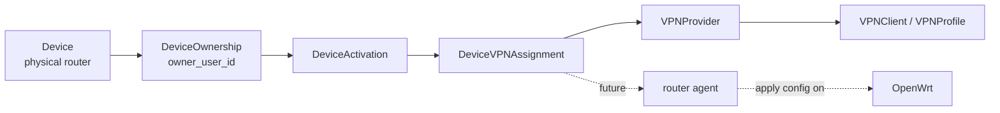

# Device VPN Assignment

`Device VPN Assignment` описывает слой, который связывает физический роутер с VPN-доступом. Этот слой не превращает `Device` в WireGuard peer и не делает WG-Easy частью модели устройства.

Правильная цепочка ответственности:

```text
Device -> DeviceOwnership -> DeviceActivation -> DeviceVPNAssignment -> VPNProvider -> VPNClient / VPNProfile
```

`Device` остается физическим роутером. `DeviceVPNAssignment` описывает, какой VPN-доступ назначен этому роутеру. Конкретный внешний клиент, peer или профиль создается через `VPNProvider`, а не напрямую через WG-Easy.

Позже `router agent` сможет получить назначенный VPN config и применить его на OpenWrt. На текущем этапе этот документ описывает только архитектуру назначения VPN-доступа.

## Назначение слоя

`Device VPN Assignment` нужен для того, чтобы отделить физическое устройство от технической реализации VPN-доступа.

Слой отвечает на вопрос:

```text
Какой VPN-доступ назначен этому физическому устройству?
```

Он не отвечает на вопросы:

- кто оплатил сервис;
- активирована ли подписка;
- какой endpoint вызывает будущий `router agent`;
- как хранится private key;
- как именно WG-Easy, AmneziaWG или OpenVPN создают внешний client.

Это разделение важно, потому что платформа продает управляемый роутер, а не конкретный WireGuard peer. В MVP текущим provider-ом может быть WG-Easy, но доменная модель должна оставаться готовой к другим protocol profiles и provider implementations.

## Границы ответственности

`Device VPN Assignment` отвечает за:

- проверку, что устройству можно назначить VPN-доступ;
- создание связи между `Device` и VPN-доступом;
- хранение ссылки на внешний VPN client/profile у конкретного provider-а;
- отзыв назначенного VPN-доступа через `VPNProvider`;
- состояние assignment: `pending`, `active`, `revoked`, `failed`.

Этот слой не отвечает за:

- billing;
- subscription checks;
- `User`, `Customer` или `Account` model;
- `router agent`;
- `heartbeat`;
- DB/migrations;
- автоматическую выдачу VPN config;
- автоматическую выдачу VPN-доступа после activation;
- хранение raw VPN config или provider secrets.

Активация устройства и назначение VPN-доступа являются разными процессами. `activation_status == activated` не должен автоматически создавать assignment и не должен автоматически выдавать VPN config.

## Основные сущности

### DeviceVPNAssignment

`DeviceVPNAssignment` представляет назначение VPN-доступа конкретному физическому устройству.

Рекомендуемые поля:

- `id` - внутренний идентификатор assignment;
- `device_id` - ссылка на физический `Device`;
- `owner_user_id_snapshot` - снимок владельца на момент назначения;
- `protocol_profile_id` - выбранный `ProtocolProfile`;
- `provider` - provider implementation, например `wg_easy`;
- `provider_client_id` - идентификатор внешнего VPN client у provider-а;
- `provider_client_name` - человекочитаемое имя внешнего client/profile;
- `status` - состояние assignment;
- `created_at` - время создания записи;
- `updated_at` - время последнего изменения;
- `assigned_at` - время успешного назначения;
- `revoked_at` - время отзыва VPN-доступа.

Статусы:

- `pending` - assignment создан, но внешний VPN client еще не подтвержден;
- `active` - VPN-доступ назначен и может использоваться;
- `revoked` - VPN-доступ отозван;
- `failed` - назначение не удалось.

`DeviceVPNAssignment` не должен хранить private key, raw VPN config, provider secrets, activation token или device secret.

### ProtocolProfile

`ProtocolProfile` описывает профиль VPN-подключения, который может быть назначен устройству.

Рекомендуемые поля:

- `id` - стабильный идентификатор профиля;
- `protocol` - WireGuard, AmneziaWG, OpenVPN или future protocol;
- `name` - человекочитаемое имя;
- `provider` - provider implementation, который умеет создать этот профиль;
- `is_default` - является ли профиль default для MVP;
- `description` - краткое описание назначения и ограничений.

Примеры:

- `wireguard_default`;
- `amneziawg_fallback`;
- `openvpn_tcp_443`.

MVP может начинаться с WireGuard, но `ProtocolProfile` нужен для того, чтобы домен не зависел от одного протокола и мог позже поддержать fallback profiles.

### VPNClientRef

`VPNClientRef` представляет ссылку на внешнего VPN client, peer или profile у конкретного provider-а.

Это не физический `Device`. Это технический VPN-доступ, который был создан для устройства или подготовлен для будущей выдачи.

Пример для WG-Easy:

- `provider = wg_easy`;
- `provider_client_id = ...`;
- `provider_client_name = ...`.

Если позже появится другой provider, структура ссылки должна остаться общей:

- `provider = amneziawg`;
- `provider_client_id = ...`;
- `provider_client_name = ...`.

## Почему нельзя завязываться на WG-Easy

Неправильная зависимость:

```text
DeviceVPNAssignmentService -> WGEasyClient
```

Такая модель делает WG-Easy частью application service и постепенно протаскивает детали конкретного provider-а в домен устройств.

Правильная зависимость:

```text
DeviceVPNAssignmentService -> VPNProvider
```

`DeviceVPNAssignmentService` должен работать через абстракцию `VPNProvider`. Конкретная реализация может быть:

- `WGEasyVPNProvider` для текущего MVP;
- `AmneziaWGProvider` позже;
- `OpenVPNProvider` позже;
- другой provider, если продукту понадобится новый protocol profile.

Такой подход сохраняет возможность заменить WG-Easy без переписывания Device Registry, Device Activation и Device VPN Assignment.

## Правила создания assignment

Для backend v1 assignment можно создать, если:

- `device` существует;
- `device.status` не равен `retired`;
- `device.status` не равен `disabled`;
- у `device` есть `owner_user_id`;
- у `device` нет active assignment.

`activation_status == activated` не должен быть обязательным условием для создания assignment в v1. VPN-доступ можно подготовить заранее до фактического включения роутера клиентом.

При этом важны два ограничения:

- activation не должна автоматически создавать assignment;
- activated device не должен автоматически получать VPN config.

Создание assignment должно проходить через application service, который проверяет состояние `Device`, выбирает `ProtocolProfile` и вызывает `VPNProvider`.

## Правила revoke

Revoke assignment означает отзыв VPN-доступа, а не удаление физического устройства.

Ожидаемое поведение:

- через `VPNProvider` отключить, удалить или revoke внешний VPN client;
- перевести `DeviceVPNAssignment.status` в `revoked`;
- заполнить `revoked_at`;
- не менять `Device.activation_status`;
- не менять `Device.owner_user_id`;
- не удалять физический `Device`;
- не удалять историю assignment.

Если provider временно недоступен, assignment может перейти в `failed` или остаться в состоянии, которое явно требует operator action. Это нужно решать отдельно в backend implementation.

## API-контур будущего backend v1

Предполагаемые admin endpoints:

- `POST /devices/{device_id}/vpn-assignment`;
- `GET /devices/{device_id}/vpn-assignment`;
- `POST /devices/{device_id}/vpn-assignment/revoke`.

Возможный будущий endpoint для поддержки и операторов:

- `GET /vpn-assignments/by-owner/{owner_user_id}`.

Эти endpoints не должны возвращать:

- private key;
- raw VPN config;
- provider secrets;
- activation token;
- device secret.

Ответы должны возвращать только безопасные metadata: assignment id, device id, protocol profile id, provider name, provider client reference, status и timestamps.

Выдача raw VPN config должна быть отдельным будущим router-agent flow с другой моделью авторизации.

## Работа без DB/persistence

Для backend v1 позже допустим process-local repository, как в предыдущих этапах Device Registry и Device Activation.

Ограничения такого подхода:

- после рестарта backend assignments будут потеряны;
- состояние внешнего provider-а может расходиться с process-local состоянием backend;
- это временное ограничение MVP;
- persistent storage и migrations должны быть отдельным будущим решением.

Если assignment backend v1 будет сделан через process-local repository, это нужно явно отметить в docstring repository и не считать production-ready storage.

## Подготовка к router agent

Текущий assignment layer только создает связь между `Device` и VPN-доступом.

Позже `router agent` сможет:

- авторизоваться через device secret;
- получить назначенный VPN profile/config;
- применить его на OpenWrt;
- отправлять heartbeat/status/diagnostics.

В текущем этапе это не реализуется. Нельзя добавлять `/device-agent/*` endpoints, heartbeat или config delivery как побочный эффект Device VPN Assignment.

## Anti-goals

В рамках `Device VPN Assignment` запрещено:

- делать `Device = WireGuard peer`;
- добавлять WG-Easy поля напрямую в `Device`;
- добавлять поля `wireguard_peer_id`, `wg_easy_client_id` или `vpn_config` напрямую в `Device`;
- выдавать VPN config по одному `device_id`;
- смешивать assignment с billing/subscription;
- добавлять `router agent`;
- добавлять `heartbeat`;
- добавлять DB/migrations;
- добавлять `User`, `Customer` или `Account` model;
- делать массовые unrelated изменения.

## Mermaid-диаграмма



## Вывод

`Device VPN Assignment` должен быть отдельным слоем между физическим устройством и конкретным VPN provider-ом. Он позволяет подготовить или отозвать VPN-доступ для устройства, не смешивая это с активацией, владением, billing, subscription, router agent или WG-Easy internals.

MVP может использовать WireGuard и WG-Easy через `VPNProvider`, но архитектура должна оставаться protocol-agnostic и готовой к AmneziaWG, OpenVPN TCP/443 и будущим protocol profiles.
