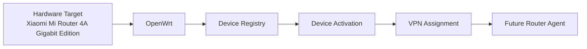

# Hardware target: Xiaomi Mi Router 4A Gigabit Edition

## Назначение документа

Этот документ фиксирует первичный аппаратный target для MVP управляемой VPN-router платформы.

Коммерческому проекту нужен бюджетный роутер, который можно использовать для первых лабораторных тестов, пилотных продаж и проверки полного managed flow: Device Registry, Device Activation, будущий router agent, выдача VPN-профиля и поддержка пользователя.

Xiaomi Mi Router 4A Gigabit Edition рассматривается как первый MVP test router. Исследование внешнего опыта, включая 3DH как источник наблюдений о похожих ручных OpenWrt-сценариях, показывает, что похожие сервисы могут опираться на недорогие OpenWrt-совместимые устройства и ручную подготовку. Это не означает, что мы копируем их подход, материалы или firmware. Наше преимущество должно быть в backend automation, Device Registry, activation, управляемости, диагностике и будущем agent flow, а не только в ручной OpenWrt-конфигурации.

## Решение

Текущее архитектурное решение для MVP:

- Primary MVP hardware target: Xiaomi Mi Router 4A Gigabit Edition.
- Primary platform: OpenWrt.
- Primary VPN profile for MVP: WireGuard.
- Fallback profiles: архитектура должна быть готова к AmneziaWG, OpenVPN TCP/443 или другим профилям, но их нельзя обещать пользователям до проверки производительности, пакетов OpenWrt и совместимости с реальными ISP.

Это решение не должно hardcode-ить платформу только под Xiaomi. Backend, Device Registry и будущий provisioning должны оставаться расширяемыми для других OpenWrt-compatible routers.

## Почему этот роутер привлекателен

Xiaomi Mi Router 4A Gigabit Edition выглядит хорошим кандидатом для MVP по нескольким причинам:

- бюджетная цена снижает стоимость первых тестов и коммерческого bundle;
- модель широко доступна на рынке;
- gigabit Ethernet лучше подходит для домашнего сценария, чем 100 Mbps WAN/LAN устройства;
- вокруг модели есть известное OpenWrt community usage;
- устройство подходит для проверки managed VPN router flow от регистрации до активации;
- это хороший low-cost candidate для первых коммерческих поставок, если валидация подтвердит стабильность.

## Важное предупреждение

Xiaomi Mi Router 4A Gigabit Edition пока не является финальным mass-sale hardware decision. Перед bulk purchase или customer rollout этот выбор должен быть подтверждён контролируемыми тестами.

Ключевые риски:

- разные hardware revisions могут отличаться по flash/RAM, SoC, bootloader или способу прошивки;
- разные stock firmware versions могут менять доступность exploit/unlock path;
- процесс flashing может отличаться между партиями;
- некоторые firmware versions могут быть сложнее или невозможно прошить стандартным способом;
- есть риск brick во время прошивки;
- recovery/unbrick path должен быть проверен до продажи;
- OpenVPN TCP/443 может быть медленным на бюджетном CPU;
- WireGuard performance нужно измерить на реальном трафике;
- flash/RAM limitations могут ограничить будущий router agent, telemetry и fallback packages;
- large-scale preparation process должен быть повторяемым, документированным и измеримым по времени.

## Hardware profile fields

Связь Xiaomi Mi Router 4A Gigabit Edition с Device Registry:

- `platform = openwrt` после успешной установки OpenWrt;
- `router_model = Xiaomi Mi Router 4A Gigabit Edition`;
- `router_revision = v1 / v2 / unknown` в зависимости от фактически найденной ревизии;
- `firmware_version = custom image or installed firmware version`;
- `openwrt_version = installed OpenWrt version`;
- `architecture = ramips/mt7621` или фактически определённая архитектура;
- `serial_number = optional`, если доступен и полезен для учёта;
- `mac_address = diagnostic only`, не trusted identity;
- `hardware_id = optional future field` для будущего устойчивого аппаратного идентификатора.

Эти поля должны храниться как metadata устройства, а не как VPN-specific data. Device остаётся физическим роутером, а не WireGuard peer.

## Чеклист валидации перед первым клиентским использованием

- Купить 2-3 test units.
- Зафиксировать точную hardware revision каждого устройства.
- Зафиксировать stock firmware version.
- Проверить OpenWrt installation path.
- Проверить recovery/unbrick path.
- Успешно установить OpenWrt.
- Включить SSH.
- Установить и проверить WireGuard support.
- Сначала настроить VPN вручную.
- Измерить throughput.
- Проверить reboot behavior.
- Проверить power loss behavior.
- Проверить autostart VPN.
- Проверить DNS behavior.
- Проверить минимум двух разных ISP, если возможно.
- Документировать failures, ограничения и нестабильные сценарии.

## Чеклист валидации перед bulk purchase

- Подтвердить, что supplier поставляет ту же revision.
- Подтвердить, что firmware version совместима с flashing process.
- Оценить flashing time per unit.
- Описать recovery procedure.
- Описать acceptance test после flashing.
- Описать labeling/serial tracking process.
- Описать backup/reflash process.
- Подготовить support notes для этой модели.
- Проверить thermal/stability behavior.
- Проверить performance с ожидаемым VPN profile.

## Связь с Device Registry

Device Registry должен хранить model, revision, firmware, OpenWrt metadata и диагностические поля для каждого физического роутера.

Device Registry не должен предполагать, что каждое устройство является Xiaomi. Xiaomi Mi Router 4A Gigabit Edition может стать первым будущим `HardwareProfile`, но модель данных должна поддерживать TP-Link, GL.iNet, MikroTik/OpenWrt-compatible устройства и другие OpenWrt routers.

Hardware compatibility data должна попадать в будущую ISP compatibility database: модель, ревизия, OpenWrt version, VPN profile, ISP, connection type, скорость, packet loss и известные ограничения.

## Связь с Device Activation и будущим router agent

Первые тесты можно начинать вручную: прошить OpenWrt, включить SSH, настроить WireGuard и проверить поведение устройства.

В будущем OpenWrt agent должен запускаться на этом роутере, если ресурсы устройства это позволяют. Activation token и будущий device secret должны храниться безопасно и не попадать в пользовательские логи или открытые конфигурации.

Позже роутер должен уметь:

- активироваться через backend;
- запрашивать назначенную конфигурацию;
- применять VPN settings;
- отправлять heartbeat/status;
- сообщать диагностические данные.

Эти возможности пока не реализованы и не должны предполагаться как существующие.

## Связь с VPN protocol strategy

WireGuard должен быть default MVP profile для первых тестов, потому что он проще, быстрее и уже соответствует текущему backend foundation через provider abstraction.

AmneziaWG, OpenVPN TCP/443 и другие fallback profiles должны оставаться будущими опциями. Их поддержка зависит от OpenWrt packages, ресурсов роутера, CPU, flash/RAM, конкретного server profile и реального поведения ISP.

Нельзя утверждать, что какой-либо VPN protocol является unblockable. Блокировки — это движущаяся цель и зависит от провайдера, региона, DPI rules, портов, traffic profile и времени.

## Наблюдение из competitor/manual setup research

В `research/external-knowledge/3dh.md` 3DH рассматривается как внешний источник инженерного опыта, а не как продукт для копирования. Документ предлагает изучать router models, OpenWrt flashing experience, user problems, ISP compatibility и практическое применение AmneziaWG/Podkop.

Релевантный вывод для этого hardware target: похожие пользовательские сценарии могут опираться на ручную подготовку OpenWrt-роутеров и поддержку конкретных моделей. Наша продуктовая ставка должна быть не в копировании ручных инструкций, branding, scripts, firmware files или paid materials, а в управляемой платформе: backend automation, Device Registry, activation flow, будущий router agent, диагностика и повторяемый production process.

Все выводы из внешних материалов нужно перепроверять собственными лабораторными тестами.

## Mermaid-диаграмма

## Заключение

Xiaomi Mi Router 4A Gigabit Edition принимается как primary budget MVP hardware target, но только после controlled validation. Платформа должна хорошо поддерживать этот роутер, сохраняя архитектуру открытой для других OpenWrt-compatible devices.
