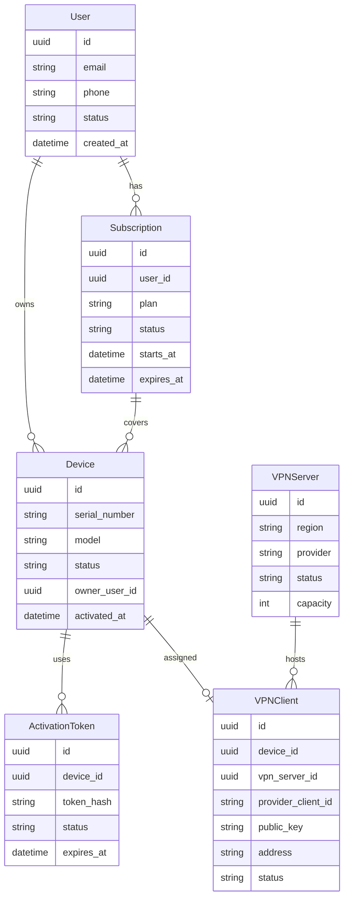
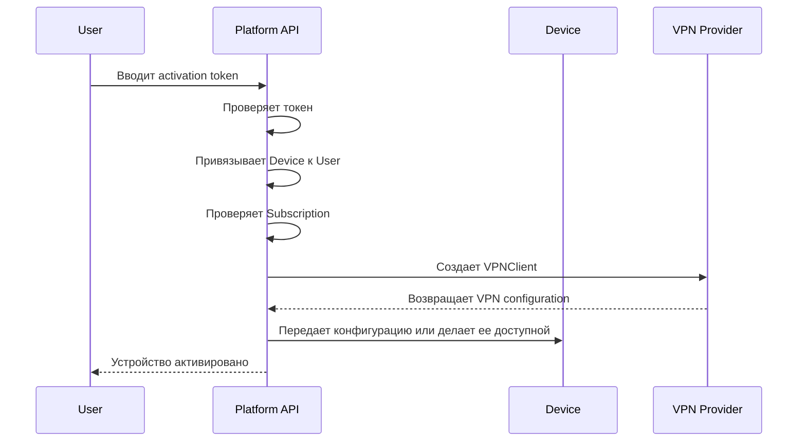
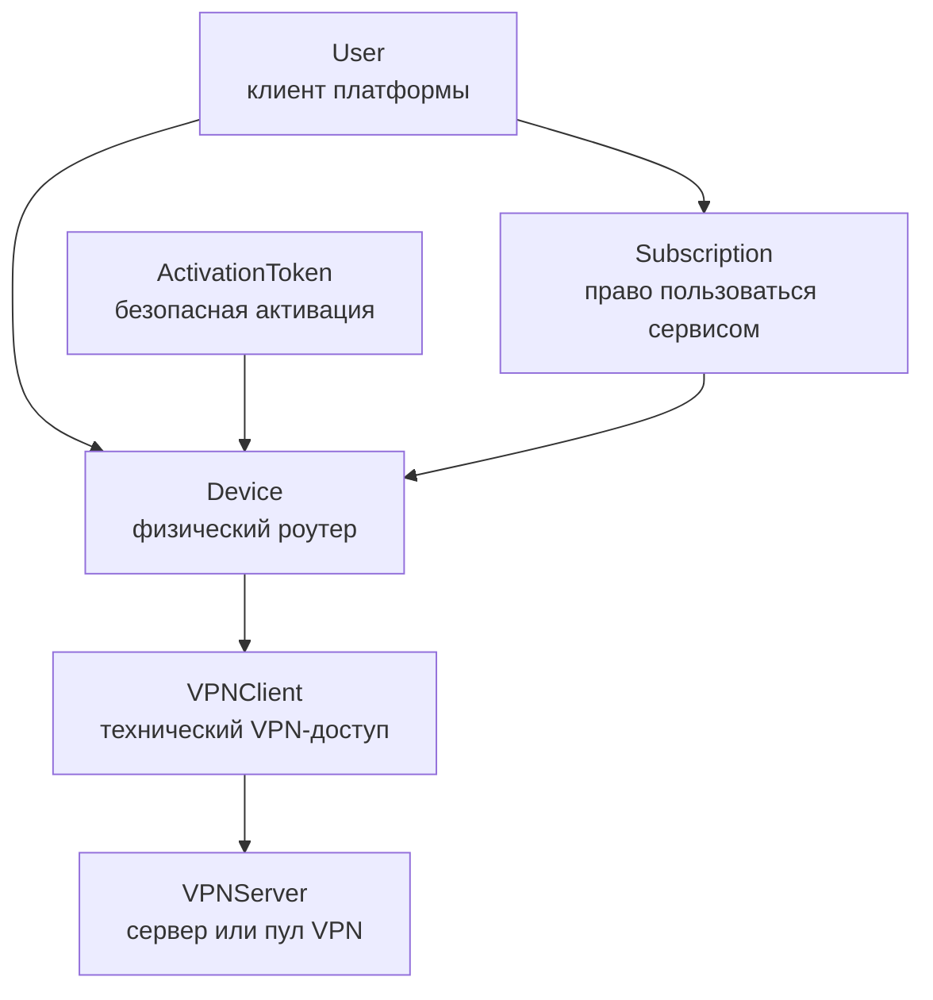

# Доменная модель VPN router platform

## Главная идея

Платформа продает физические роутеры с преднастроенным VPN-доступом и подпиской. Доменная модель должна строиться вокруг пользователя, устройства, подписки и выдачи доступа, а не вокруг конкретного VPN-провайдера.

WG-Easy, WireGuard, Amnezia или другой провайдер должны оставаться инфраструктурной деталью. Бизнес-домен должен описывать то, что важно для продукта: кто купил роутер, какое устройство активировано, есть ли действующая подписка, какой VPN-доступ выдан и на каком сервере он обслуживается.

## User

`User` существует как владелец отношений с платформой: покупки, подписки, устройства, поддержка и биллинг.

Ответственность:

- хранить идентичность клиента;
- связывать устройства и подписки;
- быть владельцем бизнес-доступа, а не технического VPN-конфига.

Пользователь может иметь несколько роутеров, несколько подписок, семейные или бизнес-тарифы в будущем.

## Device

`Device` представляет физический роутер.

Ответственность:

- хранить серийный номер, модель и состояние устройства;
- знать, активирован ли роутер;
- быть точкой привязки VPN-доступа;
- отделять физический товар от пользователя и подписки.

Примеры статусов:

- `manufactured`
- `in_stock`
- `sold`
- `activated`
- `suspended`
- `revoked`

`Device` нужен отдельно от `VPNClient`, потому что роутер может быть продан, заменен, сброшен, переактивирован или переведен на другой VPN-сервер. VPN-клиент — это технический доступ, а устройство — бизнес-объект.

## VPNClient

`VPNClient` — доменная сущность, описывающая VPN-доступ, выданный устройству.

Ответственность:

- связать устройство с конкретным VPN-сервером;
- хранить техническую идентичность клиента у провайдера;
- управлять состоянием VPN-доступа;
- быть абстракцией над WG-Easy, WireGuard или другим провайдером.

Поле `provider_client_id` нужно, чтобы система могла работать с внешним провайдером, но не зависела от его модели напрямую.

Примеры статусов:

- `pending`
- `active`
- `disabled`
- `rotating`
- `deleted`

## Subscription

`Subscription` описывает право пользователя пользоваться сервисом.

Ответственность:

- хранить тариф, срок действия и состояние оплаты;
- определять, должен ли VPN-доступ быть активным;
- связывать коммерческую часть с устройствами.

Примеры статусов:

- `trial`
- `active`
- `past_due`
- `expired`
- `cancelled`

Подписка не должна быть просто флагом на устройстве. В будущем могут появиться один тариф на несколько устройств, семейный план, корпоративный аккаунт и разные лимиты скорости, регионов или серверов.

## ActivationToken

`ActivationToken` нужен для безопасной активации роутера пользователем.

Ответственность:

- подтвердить, что устройство действительно принадлежит покупателю или партии продажи;
- позволить активировать устройство без ручной настройки;
- ограничить срок и количество использований;
- предотвратить повторную или чужую активацию.

Типичный flow:

## VPNServer

`VPNServer` представляет сервер или узел, на котором создаются VPN-клиенты.

Ответственность:

- хранить регион, провайдера, емкость и состояние;
- помогать выбирать сервер для нового устройства;
- отслеживать нагрузку и доступность;
- позволить масштабирование на несколько стран и дата-центров.

Примеры статусов:

- `active`
- `draining`
- `maintenance`
- `offline`

`VPNServer` не обязан быть физическим сервером. Это может быть logical node, endpoint, WG-Easy instance, кластер или региональный пул.

## Ключевые связи

## Будущая масштабируемость

Для будущего важно держать границы домена:

- `VPNProvider` остается интерфейсом: WG-Easy сегодня, другой провайдер завтра.
- `Device` не зависит от конкретного VPN-протокола.
- `VPNClient` не должен быть равен WireGuard peer напрямую, это доменная абстракция доступа.
- `Subscription` управляет правом доступа, но не хранит техническую конфигурацию.
- `VPNServer` позволяет балансировать новых клиентов по регионам, нагрузке и тарифам.
- `ActivationToken` позволяет масштабировать продажи через маркетплейсы, партнеров и преднастроенные партии устройств.

В будущем можно добавить:

- `Order` для покупки;
- `Plan` для тарифов;
- `Invoice` или `Payment`;
- `DeviceModel`;
- `FirmwareVersion`;
- `RouterProvisioningJob`;
- `Region`;
- `ServerPool`;
- `SupportTicket`;
- `AuditLog`.

Главная архитектурная мысль: бизнес-модель должна строиться вокруг пользователя, устройства и подписки, а VPN-провайдер должен быть заменяемым механизмом выдачи доступа.
