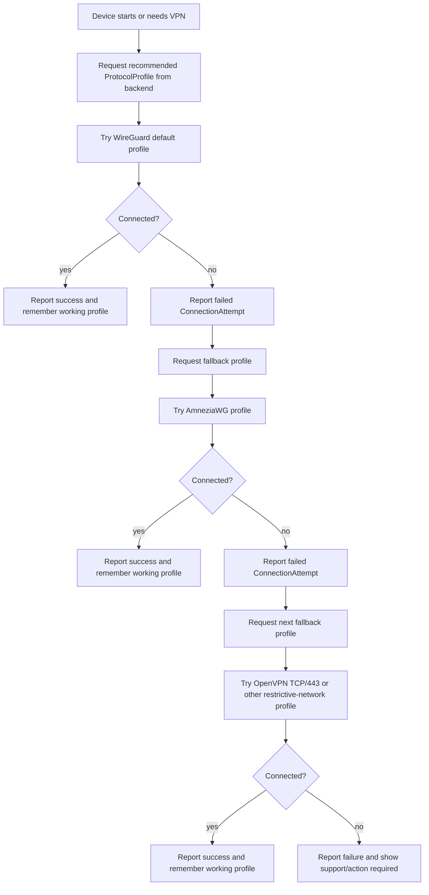

# Стратегия VPN-протоколов

Этот документ описывает протокольную стратегию для managed VPN router platform. Цель стратегии — не выбрать один "идеальный" протокол, а построить продукт так, чтобы он мог работать в разных сетевых условиях и развиваться без переписывания доменной модели.

Важно: нельзя утверждать, что какой-либо VPN-протокол является неблокируемым. Блокировки протоколов — движущаяся цель. Поведение зависит от ISP, региона, DPI-правил, портов, профиля трафика, времени и изменений в политике сетевого оператора.

## Почему нельзя привязывать платформу только к WireGuard

WireGuard хорошо подходит для MVP: он быстрый, простой, широко поддерживается и удобен для автоматической выдачи конфигураций. Но платформа продает не "WireGuard как технологию", а управляемый доступ в интернет через преднастроенный роутер.

Жесткая привязка к WireGuard опасна по нескольким причинам:

- plain WireGuard может блокироваться или ухудшаться в некоторых сетях;
- UDP может быть throttled или заблокирован;
- у разных ISP и регионов разные DPI-правила;
- часть пользователей будет находиться за CG-NAT, double NAT или нестандартными сетями;
- будущие модели роутеров могут лучше поддерживать один fallback-профиль и хуже другой;
- продуктовая логика подписки, активации и поддержки не должна зависеть от конкретного VPN-протокола.

Поэтому WireGuard должен быть MVP/default profile, но не должен становиться центром домена.

## VPN Engine как продуктовая абстракция

Пользователю не нужно знать, какой протокол используется в конкретный момент. Для продукта полезнее понятие `VPN Engine`: управляемый механизм подключения, который может использовать разные protocol profiles.

`VPN Engine` должен скрывать:

- конкретный протокол;
- порт;
- параметры обфускации;
- server profile;
- fallback-логику;
- технические ошибки подключения.

Для пользователя важнее простые состояния:

- роутер активирован;
- подписка активна;
- VPN работает;
- есть проблема подключения;
- поддержка может диагностировать причину.

## Простая лестница резервного переключения

Первая версия должна использовать простую детерминированную лестницу fallback, а не сложный автоматический алгоритм.

1. `WireGuard` как MVP/default profile.
2. `AmneziaWG` как obfuscated WireGuard fallback.
3. `OpenVPN TCP/443` или другой fallback profile для более ограничительных сетей.
4. Будущие protocol/profile support при подтвержденной необходимости.

Эта лестница не означает, что каждый следующий вариант гарантированно работает. Она только задает понятный порядок попыток и диагностики.

## MVP позиция

MVP может стартовать с WireGuard и wg-easy, потому что это самый короткий путь к проверке:

- backend flow;
- device activation flow;
- выдачи VPN-конфигурации;
- базовой поддержки клиентов;
- первичных тестов на реальных роутерах.

При этом домен и backend должны оставаться protocol-agnostic. В домене лучше думать не "WireGuard peer", а `VPNClient`, `VPNServer`, `ProtocolProfile` и `ConnectionAttempt`.

## Будущие доменные концепции

### Протокольный профиль

`ProtocolProfile` описывает конкретный профиль подключения.

Возможные поля:

- protocol: WireGuard, AmneziaWG, OpenVPN или future profile;
- transport: UDP, TCP;
- port;
- server region;
- provider implementation;
- device compatibility constraints;
- priority;
- status.

Зачем существует: чтобы backend мог назначать устройству не просто VPN-сервер, а конкретный проверенный способ подключения.

### Попытка подключения

`ConnectionAttempt` фиксирует попытку подключения устройства.

Возможные поля:

- device id;
- protocol profile;
- server;
- result;
- failure reason;
- latency;
- packet loss;
- timestamp.

Зачем существует: чтобы support и будущая аналитика понимали, какие профили реально работают, а какие нет.

### Статус подключения устройства

`DeviceConnectionStatus` описывает текущее состояние подключения устройства.

Возможные состояния:

- unknown;
- connecting;
- connected;
- failed;
- degraded;
- fallback_required;
- disabled.

Зачем существует: чтобы frontend, admin panel и support видели состояние продукта в терминах пользователя, а не в сырых логах роутера.

### Запись ISP-совместимости

`ISPCompatibilityRecord` фиксирует совместимость ISP, региона, модели роутера, firmware и protocol profile.

Зачем существует: чтобы со временем платформа могла рекомендовать профиль подключения на основе накопленных данных, а не только на основе ручных предположений.

## Поведение на стороне роутера

Роутер должен быть простым исполнителем backend-рекомендаций, но достаточно умным, чтобы переживать типовые сетевые проблемы.

Ожидаемое поведение:

1. Устройство запрашивает у backend recommended protocol profile.
2. Устройство пробует подключение.
3. Устройство сообщает success/failure и базовую диагностику.
4. Если подключение не удалось, устройство запрашивает fallback profile.
5. После успеха устройство запоминает рабочий профиль.
6. При следующем старте устройство может сначала пробовать последний рабочий профиль, если backend не выдал другое указание.

Важно: router-side logic должна быть предсказуемой. Слишком умный агент может начать менять настройки так, что support будет сложнее понять проблему.

## Поведение на стороне backend

Backend должен управлять protocol profiles как частью продукта.

Ожидаемое поведение:

- хранит доступные protocol profiles;
- назначает default/recommended profile устройству;
- записывает connection attempts;
- позволяет оператору или support принудительно задать protocol profile;
- позже может рекомендовать protocol profile на основе ISP compatibility data;
- отделяет бизнес-сущности от конкретного VPN-provider.

Операторская функция force profile важна, потому что на раннем этапе support часто будет знать больше автоматического алгоритма.

## Логика fallback

## Риски

### Доступность AmneziaWG на OpenWrt

Доступность AmneziaWG на OpenWrt зависит от пакетов, версии OpenWrt, архитектуры устройства, flash/RAM и конкретной модели роутера.

Риск: fallback может выглядеть хорошо в архитектуре, но оказаться непрактичным на дешевых устройствах.

### Производительность OpenVPN TCP/443

OpenVPN TCP/443 может быть полезен для ограничительных сетей, но часто медленнее WireGuard и может сильно нагружать CPU.

Риск: на low-end routers fallback будет работать, но пользователь получит низкую скорость.

### Различия в поведении ISP

Поведение ISP отличается по региону, типу подключения, DPI-политике, времени и конкретному тарифу.

Риск: профиль, который работает у одного пользователя, может не работать у другого пользователя того же провайдера в другом регионе.

### Чрезмерно сложная fallback-логика

Слишком сложная автоматическая fallback-логика может сделать продукт нестабильным.

Риски:

- роутер часто переключает профили;
- support не понимает текущее состояние;
- пользователь видит плавающую скорость;
- backend получает шумные данные;
- диагностика становится сложнее самой проблемы.

## Вывод

Первая версия должна использовать простой детерминированный fallback, а не сложный автоматический алгоритм. MVP может стартовать с WireGuard/wg-easy, но домен, backend и будущий router agent должны быть protocol-agnostic и готовыми к нескольким protocol profiles.
